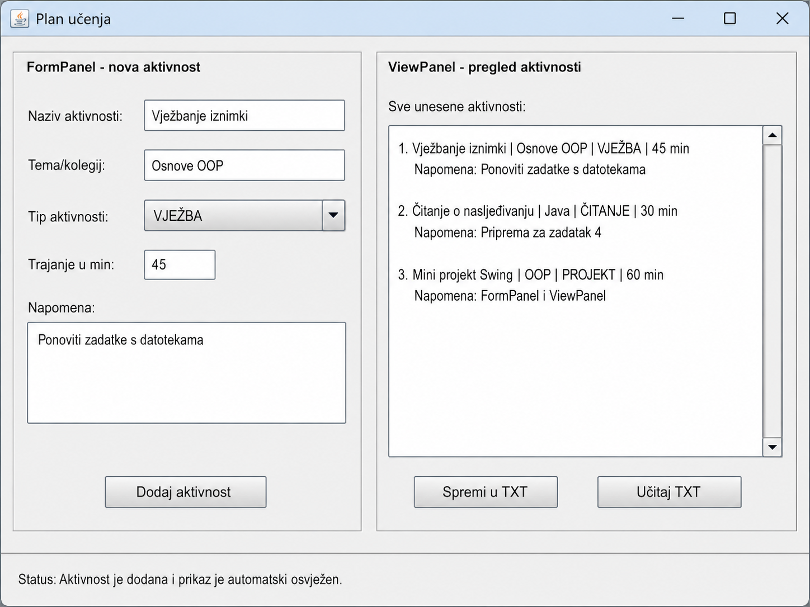

# Osnove objektno orijentiranog programiranja

##Završni ispit - problemski zadaci

####Datum: 3. 7. 2026.

**Posebna napomena:** korištenje lambda izraza nije dopušteno. Sva rješenja trebaju biti u mapi `RJESENJA`.

# Raspodjela ocjena po zadacima

Studenti sami biraju koje zadatke će rješavati prema ciljanoj ocjeni. Zadaci 1 i 2 predstavljaju obvezni dio za sve ocjene. Zadaci 3, 4 i 5 nisu kumulativni: za ocjenu dobar rješava se zadatak 3, za ocjenu vrlo dobar zadatak 4, a za ocjenu izvrstan zadatak 5.

| **Ciljana ocjena** | **Zadaci koji se rješavaju** | **Ukupno vrijeme** | **Naglasak provjere** |
|--------------------|------------------------------|--------------------|------------------------|
| dovoljan (2)       | 1 + 2                        | 70 minuta          | osnovne klase, rad s tekstualnim datotekama, osnovni Swing GUI |
| dobar (3)          | 1 + 2 + 3                    | 80 minuta          | proširenje osnovnog rješenja pretraživanjem, sortiranjem i ponovnom uporabom klasa |
| vrlo dobar (4)     | 1 + 2 + 4                    | 90 minuta          | nasljeđivanje, polimorfizam i serijalizacija/deserijalizacija objekata |
| izvrstan (5)       | 1 + 2 + 5                    | 120 minuta         | cjelovitiji objektni model, obrada dviju ulaznih datoteka, pravila obrade i binarna pohrana |

# Opća pravila

- Svaki zadatak zahtijeva zasebnu granu → primjerice **zad_1** je grana s rješenjem prvog zadatka.
- Rješenje mora biti organizirano u više smislenih klasa. Rješenja u jednoj velikoj klasi neće se smatrati potpunima ni ako se program pokreće.
- Nije dopušteno koristiti lambda izraze. Nije potrebno koristiti Stream API; preporučuje se rad s klasičnim petljama i kolekcijama.
- Svi nazivi ulaznih i izlaznih datoteka trebaju biti relativni u odnosu na korijensku mapu projekta.
- Program ne smije prestati s radom zbog jedne neispravne linije u ulaznoj tekstualnoj datoteci. Neispravne zapise potrebno je preskočiti i evidentirati gdje je to zatraženo.
- Kod treba biti čitljiv: smisleni nazivi klasa, metoda i atributa, osnovna validacija, kratki komentari samo tamo gdje pojašnjavaju odluku.
- Minimalni uvjet za svaku granu: projekt se mora kompajlirati i pokrenuti, mora sadržavati odvojene klase za domenske objekte i ne smije sadržavati lambda izraze.

# Zadatak 1 - Kontrola laboratorijskih uzoraka

U mapi `DATA` nalazi se tekstualna datoteka `podaci_zad_1.txt`.

Svaki redak ima oblik: `oznaka;materijal;laboratorij;temperatura;vlaznost;pakiranje`. Polje `pakiranje` može imati samo vrijednosti `DA` ili `NE`. Temperatura je cijeli broj u rasponu od -20 do 40, a vlažnost je cijeli broj u rasponu od 0 do 100.

1. Izradite klasu `UzorakKontrola` s atributima koji odgovaraju podacima iz retka. Klasa mora imati konstruktor, gettere/settere prema potrebi, metodu `toString()` i metodu `izracunajStatus()`.
2. Metoda `izracunajStatus()` vraća jedan od statusa: `PRIHVACEN`, `DODATNA_PROVJERA` ili `ODBIJEN`.
3. Status `PRIHVACEN` dodjeljuje se ako je temperatura od 2 do 8 stupnjeva, vlažnost nije veća od 60 i pakiranje je `DA`.
4. Status `DODATNA_PROVJERA` dodjeljuje se ako je pakiranje `DA` i vrijedi barem jedan od sljedećih uvjeta: temperatura je od -1 do 1, temperatura je od 9 do 12 ili je vlažnost od 61 do 75.
5. Svi ostali ispravni zapisi dobivaju status `ODBIJEN`.
6. Neispravne linije iz datoteke `podaci_zad_1.txt` zapišite u datoteku `greske.txt` u obliku: `brojRetka -> sadržajRetka -> kratko objašnjenje`.
7. Za ispravne zapise izradite datoteku `izvjestaj.txt`. U izvještaju za svaki uzorak navedite oznaku, materijal, laboratorij i status.
8. Na kraju izvještaja dodajte sažetak: ukupan broj ispravnih zapisa, broj zapisa po statusima i prosječnu temperaturu ispravnih zapisa zaokruženu na dvije decimale.
9. Dodajte metodu `jeKriticanZapis()` koja vraća `true` ako je temperatura manja od -5 ili veća od 15, ili ako je vlažnost veća od 85. Takve zapise u izvještaju označite znakom `*` na kraju retka.

Primjer strukture datoteke `izvjestaj.txt`:

```text
UZ-001 Krv LAB-A -> PRIHVACEN
UZ-002 Voda LAB-B -> DODATNA_PROVJERA
UZ-003 Tlo LAB-C -> ODBIJEN *
...

SAZETAK
Ukupno ispravnih zapisa: 6
Prihvaćen: ...
Dodatna provjera: ...
Odbijen: ...
Prosječna temperatura: ...
```

## Očekivani elementi rješenja za zadatak 1

- najmanje jedna zasebna domenska klasa, a ne samo obrada u `main` metodi;
- rad s `ArrayList<UzorakKontrola>` ili drugom odgovarajućom kolekcijom;
- obrada iznimaka pri parsiranju brojeva i provjeri broja polja;
- provjera dopuštenih raspona temperature i vlažnosti;
- pisanje dviju tekstualnih izlaznih datoteka: `izvjestaj.txt` i `greske.txt`.

# Zadatak 2 - Jednostavni Swing GUI za plan učenja

Potrebno je izraditi GUI aplikaciju za unos aktivnosti u plan učenja. GUI mora biti drugačiji od aplikacije za prijavu problema i treba sadržavati dva odvojena panela: `FormPanel` za unos nove aktivnosti i `ViewPanel` za prikaz aktivnosti.

Izgled GUI-ja treba biti približno kao na slici 1. Cilj nije kopirati dimenzije do piksela, nego izraditi stvarni `JFrame` s jasno odvojenim panelima, odgovarajućim Swing komponentama i automatskim osvježavanjem prikaza nakon dodavanja ili učitavanja aktivnosti.



**Slika 2:** Izgledu GUI sučelja uz drugi zadatak


Zadani tipovi aktivnosti su `CITANJE`, `VJEZBA`, `PONAVLJANJE` i `PROJEKT`, koje je potrebno definirati kao `enum`.

1. Izradite klasu `AktivnostUcenja` koja obuhvaća naziv aktivnosti, temu/kolegij, tip aktivnosti, trajanje u minutama i napomenu.
2. Dugme `Dodaj aktivnost` dodaje aktivnost u strukturu podataka parametriziranu klasom `AktivnostUcenja` te odmah osvježava prikaz aktivnosti u `JTextArea` elementu.
3. Dugme `Spremi u TXT` sprema sve aktivnosti iz pripadne strukture podataka u TXT datoteku `plan_ucenja.txt` u mapi `DATA`.
4. Dugme `Učitaj TXT` učitava sve podatke iz datoteke `plan_ucenja.txt` i prikazuje ih u prostoru za prikaz aktivnosti. U tom se slučaju brišu sve dotadašnje aktivnosti iz pripadne strukture podataka i zamjenjuju onima iz učitane datoteke.
5. Nakon dodavanja ili učitavanja aktivnosti potrebno je prikaz automatski osvježiti tako da korisnik ne mora pokretati dodatnu akciju za prikaz podataka.
6. Potrebno je validirati da naziv aktivnosti, tema/kolegij i trajanje nisu prazni te da je trajanje pozitivan cijeli broj.
7. Za pisanje i čitanje podataka u TXT i iz TXT datoteke treba koristiti pomoćnu klasu `AUX_RW` koja se nikad neće instancirati. Ne zaboravite na upravljanje iznimkama.

**VAŽNO:** Rješenja bez dva odvojena panela `FormPanel` i `ViewPanel` neće se priznavati kao potpuna.

## Očekivani elementi rješenja za zadatak 2

- funkcionalan `JFrame` s osnovnim Swing komponentama i dva odvojena panela;
- odvojena klasa `AktivnostUcenja` i pohrana objekata u kolekciju;
- enum `TipAktivnosti` s propisanim vrijednostima;
- validacija praznih tekstualnih polja i trajanja u minutama;
- automatsko osvježavanje prikaza aktivnosti u `JTextArea` elementu nakon dodavanja ili učitavanja;
- spremanje aktivnosti u tekstualnu datoteku `plan_ucenja.txt`;
- čitanje aktivnosti iz tekstualne datoteke `plan_ucenja.txt`;
- nema lambda izraza u `ActionListener` klasama.

# Zadatak 3 - Proširenje za ocjenu dobar (3): pretraživanje i kontrolna lista

Rješava se uz zadatke 1 i 2. Zadatak je zamišljen kao kratko proširenje rješenja iz zadatka 1.

1. U programu iz zadatka 1 dodajte metodu `pronadiPoOznaci` koja prima kolekciju objekata `UzorakKontrola` i oznaku uzorka te vraća pronađeni objekt ili `null` ako zapis ne postoji.
2. Omogućite unos oznake uzorka preko konzole i ispišite pronađeni zapis u čitljivom obliku. Ako zapis ne postoji, ispišite poruku da oznaka nije pronađena.
3. Ispravne zapise sortirajte prema statusu u redoslijedu `ODBIJEN`, `DODATNA_PROVJERA`, `PRIHVACEN`, a unutar istog statusa prema nazivu laboratorija i oznaci uzorka.
4. Sortiranje izvedite pomoću zasebne klase koja implementira `Comparator<UzorakKontrola>` ili pomoću anonimne unutarnje klase. Lambda izrazi nisu dopušteni.
5. Sortirane podatke zapišite u datoteku `kontrolna_lista.txt` u mapi `DATA`.

Primjer strukture datoteke `kontrolna_lista.txt`:

```text
ODBIJEN - LAB-C - UZ-003 - Tlo - temp: 18 - vlaga: 92
DODATNA_PROVJERA - LAB-B - UZ-002 - Voda - temp: 10 - vlaga: 65
PRIHVACEN - LAB-A - UZ-001 - Krv - temp: 5 - vlaga: 48
```

## Očekivani elementi rješenja za zadatak 3

- ponovna uporaba klase `UzorakKontrola` iz zadatka 1;
- pretraživanje bez prekida programa ako oznaka ne postoji;
- sortiranje preko `Comparatora` bez lambda izraza;
- zapis sortirane kontrolne liste u tekstualnu datoteku.

# Zadatak 4 - Proširenje za ocjenu vrlo dobar (4)

Rješava se samo za ocjenu vrlo dobar (4), uz zadatke 1 i 2. Cilj zadatka je provjeriti razumijevanje nasljeđivanja, polimorfizma te serijalizacije i deserijalizacije objekata.

U projektu izradite tekstualnu datoteku `sadrzaji.txt` u mapi `DATA` sa sljedećim sadržajem:

```text
C;CL-101;Uvod u Java klase;5;12
P;PO-020;Swing bez lambda izraza;4;18
C;CL-102;Iznimke u praksi;3;9
P;PO-021;Rad s tekstualnim datotekama;2;22
```

Oznaka `C` predstavlja članak, a oznaka `P` predstavlja podcast. Za članak posljednje polje označava broj stranica, a za podcast trajanje u minutama. Ocjena je cijeli broj od 1 do 5.

1. Izradite apstraktnu klasu `MedijskiSadrzaj` koja implementira `Serializable` i sadrži zajedničke atribute: `sifra`, `naslov` i `ocjena`.
2. U klasi `MedijskiSadrzaj` definirajte metodu `jePreporuceno()` koja vraća `true` ako je ocjena veća ili jednaka 4.
3. U klasi `MedijskiSadrzaj` definirajte apstraktnu metodu `opis()`.
4. Izradite klase `Clanak` i `Podcast` koje nasljeđuju klasu `MedijskiSadrzaj` i implementiraju metodu `opis()`.
5. Sve klase koje se spremaju u binarnu datoteku trebaju imati odgovarajući `serialVersionUID` koji nije postavljen automatski.
6. Učitajte podatke iz datoteke `sadrzaji.txt` u `ArrayList<MedijskiSadrzaj>`. Neispravne retke preskočite uz ispis kratke poruke u konzoli.
7. Kolekciju objekata spremite u binarnu datoteku `sadrzaji.bin` pomoću `ObjectOutputStream` u mapu `DATA`.
8. Iz datoteke `sadrzaji.bin` učitajte objekte pomoću `ObjectInputStream` u novu kolekciju.
9. Iz deserijalizirane kolekcije izradite tekstualnu datoteku `sadrzaji_iz_bin.txt`. U njoj za svaki objekt ispišite rezultat metode `opis()` i oznaku `PREPORUCENO` ili `NIJE_PREPORUCENO`.
10. Na kraju datoteke `sadrzaji_iz_bin.txt` ispišite ukupan broj preporučenih i nepreporučenih sadržaja.

Primjer strukture datoteke `sadrzaji_iz_bin.txt`:

```text
Članak CL-101 - Uvod u Java klase - 12 stranica - ocjena: 5 - PREPORUCENO
Podcast PO-020 - Swing bez lambda izraza - 18 min - ocjena: 4 - PREPORUCENO
...

SAZETAK
Preporučeno: ...
Nije preporučeno: ...
```

## Očekivani elementi rješenja za zadatak 4

- apstraktna nadklasa i dvije konkretne podklase;
- polimorfno pozivanje metode `opis()` preko reference tipa `MedijskiSadrzaj`;
- ispravna serijalizacija i deserijalizacija cijele kolekcije;
- dokaz da se izvještaj `sadrzaji_iz_bin.txt` izrađuje iz deserijaliziranih, a ne iz izvorno učitanih objekata.

# Zadatak 5 - Proširenje za ocjenu izvrstan (5): obrada projektnih troškova

Rješava se samo za ocjenu izvrstan (5), uz zadatke 1 i 2. Zadatak traži cjelovitiji objektni model, obradu dviju ulaznih tekstualnih datoteka, primjenu sučelja za pravilo obrade te serijalizaciju i deserijalizaciju rezultata obrade.

U projektu izradite tekstualnu datoteku `projekti.txt` u mapi `DATA` sa sljedećim sadržajem:

```text
AI-LAB;1200
DIG-HUM;700
EKO-SENZ;0
WEB-NST;500
```

U projektu izradite tekstualnu datoteku `troskovi.txt` u mapi `DATA` sa sljedećim sadržajem:

```text
T001;Ana Marić;AI-LAB;450;GPU računalni resursi
T002;Marko Kovač;DIG-HUM;300;Digitalizacija građe
T003;Iva Jurić;EKO-SENZ;200;Senzorski materijal
T004;Niko Radić;AI-LAB;900;Obrada podataka
T005;Lucija Perić;WEB-NST;200;Izrada nastavnih materijala
T006;Ivan Borović;ARH-PRJ;150;Arhivska usluga
T007;Marta Jelić;WEB-NST;x;Neispravan iznos
```

1. Izradite klasu `ProjektFond` sa svojstvima `oznakaProjekta` i `preostaliIznos`.
2. Izradite klasu `ZahtjevTroska` sa svojstvima `sifraTroska`, `podnositelj`, `oznakaProjekta`, `trazeniIznos` i `opisTroska`.
3. Izradite klasu `ObradeniTrosak` koja sadrži izvorni zahtjev troška, odobreni iznos, status i razlog odluke. Status može biti `ODOBRENO`, `DJELOMICNO` ili `ODBIJENO`.
4. Klase koje se spremaju u binarnu datoteku trebaju implementirati `Serializable` i imati `serialVersionUID`.
5. Izradite sučelje `PraviloFinanciranja` s metodom koja prima jedan zahtjev troška i dostupno stanje projektnih fondova te vraća `ObradeniTrosak`.
6. Izradite klasu `StandardnoPraviloFinanciranja` koja implementira `PraviloFinanciranja`.
7. Ako projekt ne postoji u popisu fondova, trošak se odbija s razlogom `NEPOSTOJECI_PROJEKT`.
8. Ako je preostali iznos za projekt 0, trošak se odbija s razlogom `NEMA_SREDSTAVA`.
9. Ako je preostali iznos veći ili jednak traženom iznosu, trošak se odobrava u cijelosti i stanje fonda se umanjuje za odobreni iznos.
10. Ako je preostali iznos manji od traženog, ali veći od 0, trošak se djelomično odobrava za preostali iznos, a stanje fonda za taj projekt postaje 0.
11. Troškovi se obrađuju redoslijedom kojim su zapisani u datoteci `troskovi.txt`. Ovaj uvjet je važan jer raniji troškovi mijenjaju stanje fondova za kasnije troškove.
12. Neispravne linije iz `troskovi.txt` zapišite u datoteku `troskovi_greske.txt`. Program se ne smije prekinuti zbog neispravnog iznosa ili pogrešnog broja polja.
13. Sve ispravno obrađene troškove spremite u binarnu datoteku `troskovi_obradeni.bin` u mapi `DATA`.
14. Nakon spremanja obvezno ponovno učitajte podatke iz `troskovi_obradeni.bin` i tek iz deserijaliziranih objekata izradite datoteku `odluke_troskovi.txt`.
15. Na kraju datoteke `odluke_troskovi.txt` ispišite završno stanje projektnih fondova nakon svih odobrenih i djelomično odobrenih troškova.
16. U kratkoj datoteci `README.txt` napišite dvije do tri rečenice: zašto je u ovom zadatku uvedeno sučelje `PraviloFinanciranja` i gdje se u rješenju vidi polimorfizam.

Primjer strukture datoteke `odluke_troskovi.txt`:

```text
T001 - Ana Marić - AI-LAB - ODOBRENO - odobreno: 450 - razlog: DOVOLJNO_SREDSTAVA
T002 - Marko Kovač - DIG-HUM - ODOBRENO - odobreno: 300 - razlog: DOVOLJNO_SREDSTAVA
T003 - Iva Jurić - EKO-SENZ - ODBIJENO - odobreno: 0 - razlog: NEMA_SREDSTAVA
T004 - Niko Radić - AI-LAB - DJELOMICNO - odobreno: 750 - razlog: NEDOVOLJNO_SREDSTAVA
...

ZAVRŠNO STANJE PROJEKTNIH FONDOVA
AI-LAB: 0
DIG-HUM: 400
EKO-SENZ: 0
WEB-NST: 300
```

## Očekivani elementi rješenja za zadatak 5

- odvojene klase `ProjektFond`, `ZahtjevTroska`, `ObradeniTrosak` i klasa koja provodi pravilo obrade;
- sučelje `PraviloFinanciranja` i konkretna implementacija `StandardnoPraviloFinanciranja`;
- obrada dviju ulaznih tekstualnih datoteka i evidentiranje neispravnih zahtjeva za trošak;
- promjena stanja fondova tijekom obrade troškova po redoslijedu iz datoteke;
- serijalizacija i deserijalizacija obrađenih troškova;
- izrada izvještaja `odluke_troskovi.txt` iz deserijaliziranih podataka;
- kratko objašnjenje korištenja sučelja i polimorfizma.

**Provjerite da se binarne datoteke u zadacima 4 i 5 ne stvaraju samo formalno, nego da se podaci doista ponovno učitavaju iz njih.**
